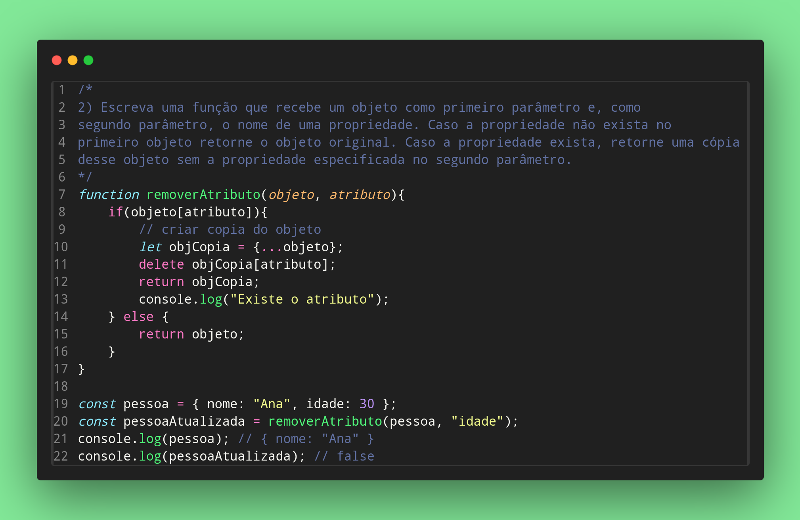

### Exrecicio Javascript 02

2) Escreva uma função que recebe um objeto como primeiro parâmetro e, como
segundo parâmetro, o nome de uma propriedade. Caso a propriedade não exista no
primeiro objeto retorne o objeto original. Caso a propriedade exista, retorne uma cópia
desse objeto sem a propriedade especificada no segundo parâmetro.

Feito por ***Viviane Aguiar***