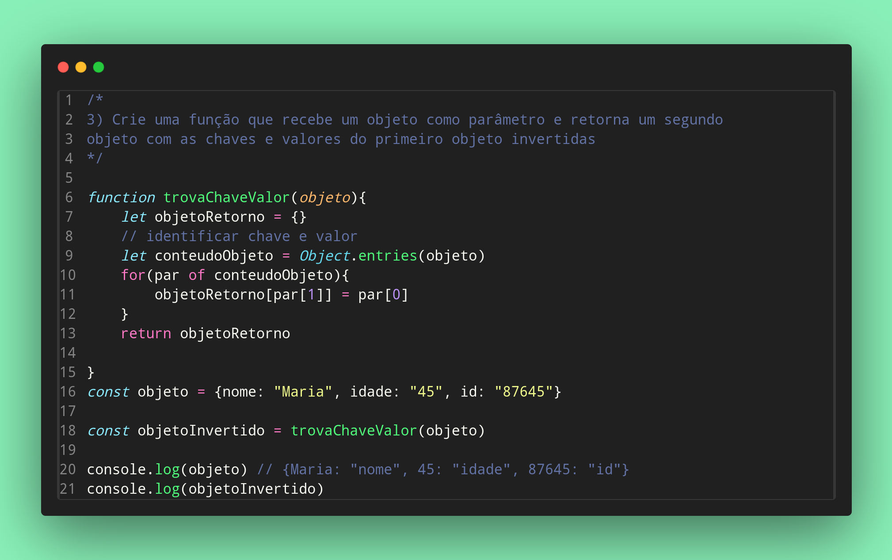

### Exercicios de Javascript

3) Crie uma função que recebe um objeto como parâmetro e retorna um segundo
objeto com as chaves e valores do primeiro objeto invertidas

Feito por ***Viviane Aguiar***