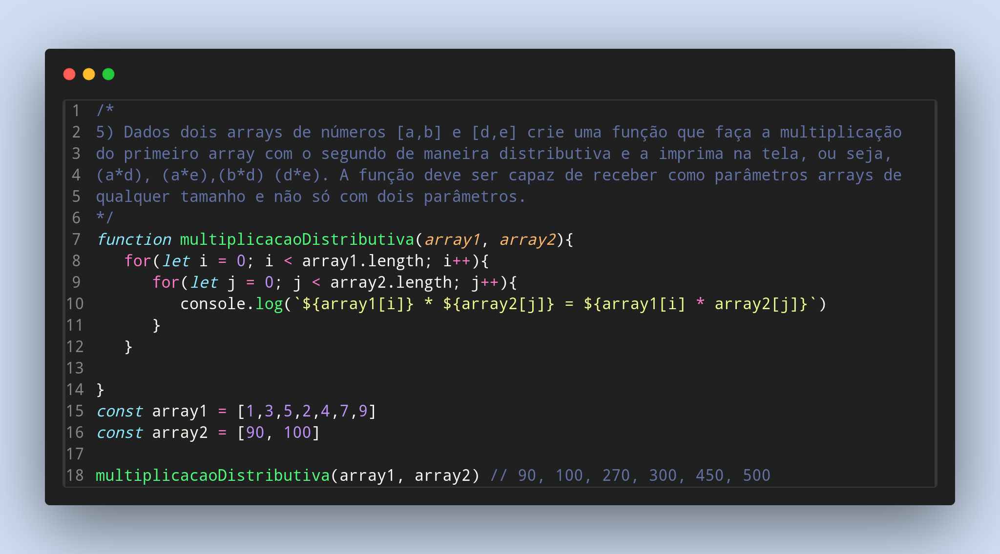

### Exercicios de Javascript

5) Dados dois arrays de números [a,b] e [d,e] crie uma função que faça a multiplicação
do primeiro array com o segundo de maneira distributiva e a imprima na tela, ou seja,
(a*d), (a*e),(b*d) (d*e). A função deve ser capaz de receber como parâmetros arrays de
qualquer tamanho e não só com dois parâmetros.

Feito por ***Viviane Aguiar***