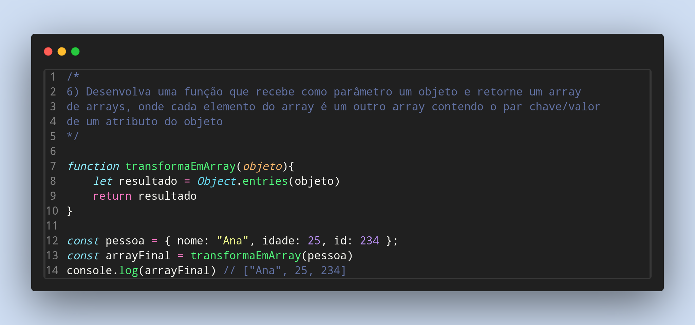

### Exercicios de Javascript

6) Desenvolva uma função que recebe como parâmetro um objeto e retorne um array
de arrays, onde cada elemento do array é um outro array contendo o par chave/valor
de um atributo do objeto

Feito por ***Viviane Aguiar***