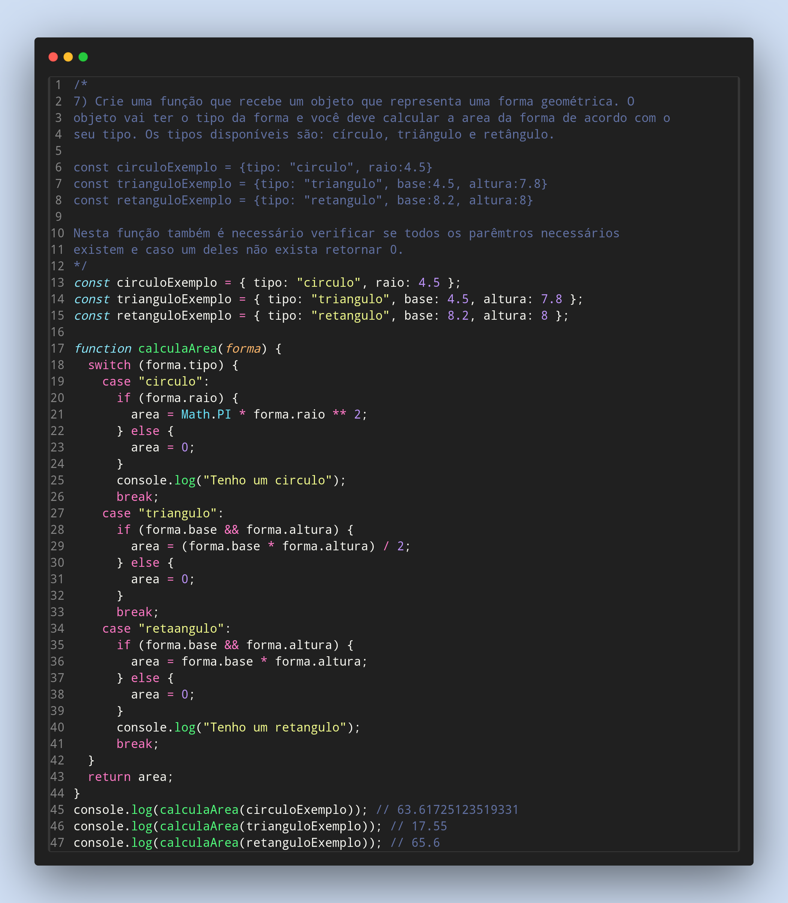

### Exercicios de Javascript

7) Crie uma função que recebe um objeto que representa uma forma geométrica. O
objeto vai ter o tipo da forma e você deve calcular a area da forma de acordo com o
seu tipo. Os tipos disponíveis são: círculo, triângulo e retângulo.

- const circuloExemplo = {tipo: "circulo", raio:4.5}
- const trianguloExemplo = {tipo: "triangulo", base:4.5, altura:7.8}
- const retanguloExemplo = {tipo: "retangulo", base:8.2, altura:8}

Nesta função também é necessário verificar se todos os parêmtros necessários
existem e caso um deles não exista retornar 0.

Feito por ***Viviane Aguiar***