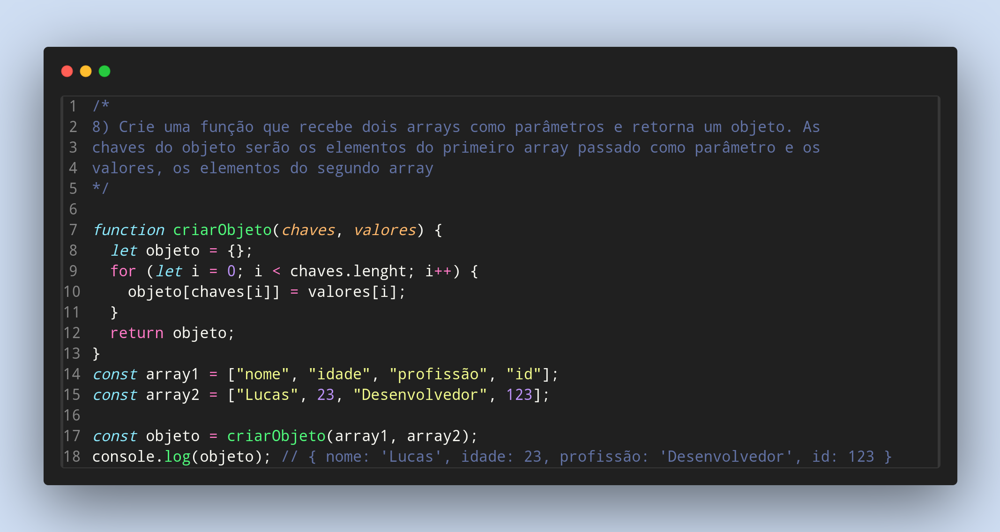

### Exercicios de Javascript

8) Crie uma função que recebe dois arrays como parâmetros e retorna um objeto. As
chaves do objeto serão os elementos do primeiro array passado como parâmetro e os
valores, os elementos do segundo array

Feito por ***Viviane Aguiar***