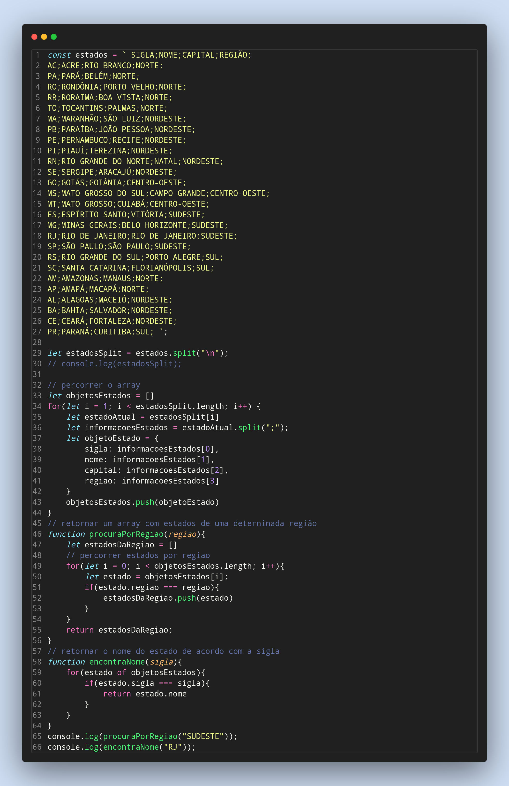

### Exercicios de Javascript

9) Com base na lista abaixo que contém a sigla, o nome, a capital e a região dos
estados do Brasil:

const estados = ` SIGLA;NOME;CAPITAL;REGIÃO;
AC;ACRE;RIO BRANCO;NORTE;
PA;PARÁ;BELÉM;NORTE;
RO;RONDÔNIA;PORTO VELHO;NORTE;
RR;RORAIMA;BOA VISTA;NORTE;
TO;TOCANTINS;PALMAS;NORTE;
MA;MARANHÃO;SÃO LUIZ;NORDESTE;
PB;PARAÍBA;JOÃO PESSOA;NORDESTE;
PE;PERNAMBUCO;RECIFE;NORDESTE;
PI;PIAUÍ;TEREZINA;NORDESTE;
RN;RIO GRANDE DO NORTE;NATAL;NORDESTE;
SE;SERGIPE;ARACAJÚ;NORDESTE;
GO;GOIÁS;GOIÂNIA;CENTRO-OESTE;
MS;MATO GROSSO DO SUL;CAMPO GRANDE;CENTRO-OESTE;
MT;MATO GROSSO;CUIABÁ;CENTRO-OESTE;
ES;ESPÍRITO SANTO;VITÓRIA;SUDESTE;
MG;MINAS GERAIS;BELO HORIZONTE;SUDESTE;
RJ;RIO DE JANEIRO;RIO DE JANEIRO;SUDESTE;
SP;SÃO PAULO;SÃO PAULO;SUDESTE;
RS;RIO GRANDE DO SUL;PORTO ALEGRE;SUL;
SC;SANTA CATARINA;FLORIANÓPOLIS;SUL;
AM;AMAZONAS;MANAUS;NORTE;
AP;AMAPÁ;MACAPÁ;NORTE;
AL;ALAGOAS;MACEIÓ;NORDESTE;
BA;BAHIA;SALVADOR;NORDESTE;
CE;CEARÁ;FORTALEZA;NORDESTE;
PR;PARANÁ;CURITIBA;SUL; `

- Transforme o conteúdo da variável estados em um array de objetos, onde cada
objeto representa um estado com a sigla, o estado, a capital e a região
Crie uma função que irá retornar todos os estados de uma determinada região
Cria uma função que retorne o nome do estado de acordo com a sigla

Feito por ***Viviane Aguiar***